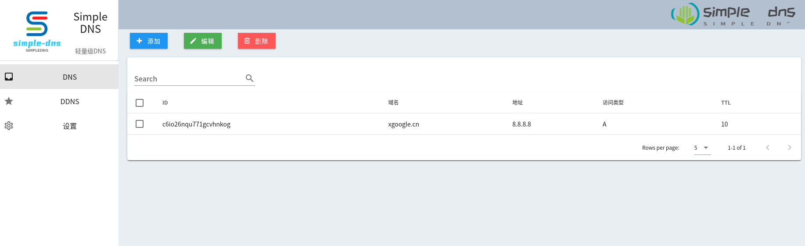

# SimpleDns

Simple DNS relay server with customizable routing tables


web: https://github.com/XC-Zero/simple_dns



### deploy
``` 
docker-compose up -d
```


### routing table exp:
routing_table.csv
``` 
domain,ip
domain,ip
```

### runing
`go build cmd/simple_dns/simple_dns.go`
